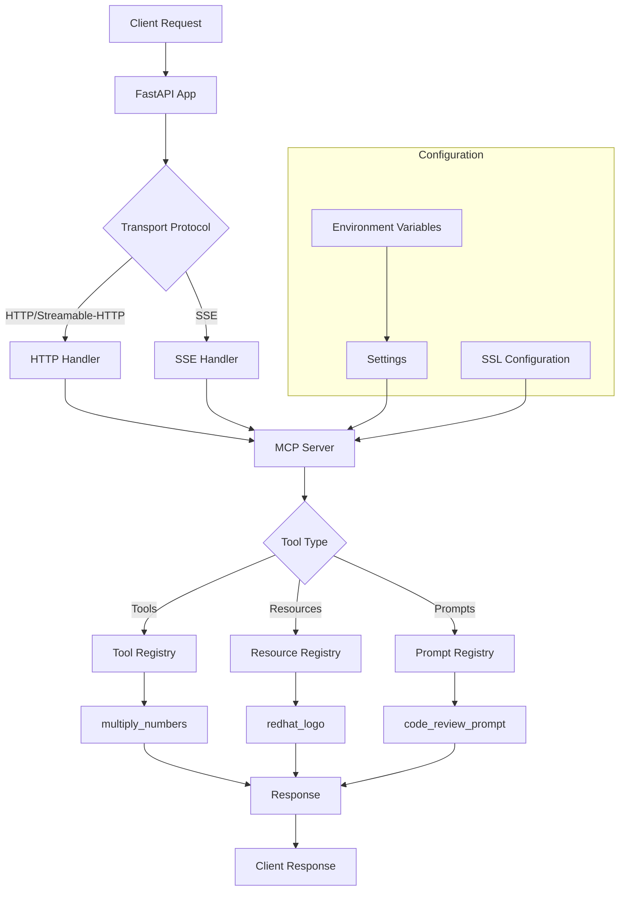

# Template MCP Server

A Model Context Protocol (MCP) server template that provides a foundation for building MCP servers. This template can be customized for various data operations and management functionality.

## 1. Description

The Template MCP Server is a production-ready foundation for building Model Context Protocol (MCP) servers. It provides a complete framework with:

- **FastAPI-based HTTP server** with multiple transport protocol support
- **Modular tool system** for easy extension and customization
- **Resource management** for file and asset handling
- **Prompt templates** for AI interactions
- **Comprehensive testing** and deployment configurations
- **OpenShift deployment** ready with SSL support

The server supports multiple transport protocols (HTTP, SSE, Streamable-HTTP) and includes built-in tools for mathematical operations, resource access, and code review prompts.

## 2. Architecture

### 2.1 Flow Diagram



### 2.2 Code Structure

```
template-mcp-server/
├── template_mcp_server/
│   ├── src/
│   │   ├── main.py              # Server entry point
│   │   ├── api.py               # FastAPI application setup
│   │   ├── mcp.py               # MCP server implementation
│   │   ├── settings.py          # Configuration management
│   │   ├── tools/               # MCP tools
│   │   │   └── multiply_tool.py
│   │   ├── resources/           # MCP resources
│   │   │   └── redhat_logo.py
│   │   └── prompts/             # MCP prompts
│   │       └── code_review_prompt.py
│   └── utils/
│       └── pylogger.py          # Logging utilities
├── examples/                     # Client examples
│   ├── fastmcp_client.py
│   └── langgraph_client.py
├── tests/                       # Comprehensive test suite
├── openshift/                   # OpenShift deployment configs
├── compose.yaml                 # Docker Compose configuration
├── Containerfile               # Container definition
└── pyproject.toml             # Project configuration
```

## 3. Installation

### Prerequisites

- Python 3.12 or higher
- uv (install from https://docs.astral.sh/uv/getting-started/installation/)

### Install from source

```bash
# Clone the repository
git clone https://gitlab.cee.redhat.com/dataverse/ai/mcp-servers/template-mcp-server.git
cd template-mcp-server

# Create venv and activate
uv venv --python 3.12
source .venv/bin/activate

# Install the package
uv pip install -e ".[dev]"
```

## 4. Run the pytests

```bash
# Run all tests
pytest

# Run tests with coverage
pytest --cov=template_mcp_server

# Run specific test file
pytest tests/test_tools.py

# Run tests with verbose output
pytest -v
```

## 5. Environment File

Copy the contents of `.env.template` to `.env`:

```env
# MCP Server Configuration
MCP_HOST=0.0.0.0
MCP_PORT=4000
MCP_TRANSPORT_PROTOCOL=http
# MCP_SSL_KEYFILE=/path/to/ssl_key.pem
# MCP_SSL_CERTFILE=/path/to/ssl_cert.pem

# Python Logging
PYTHON_LOG_LEVEL=INFO
```

### 5.1 Transport Protocol

The server supports multiple transport protocols that can be configured via the `MCP_TRANSPORT_PROTOCOL` environment variable:

- **http/streamable-http**: Standard HTTP for request-response communication (both use the same implementation)
- **sse**: Server-Sent Events (SSE) for event-driven communication (deprecated)

**Note**: Both **http** and **streamable-http** protocols use the same HTTP implementation and are functionally identical. We recommend using **http** or **streamable-http** for most use cases as they provide the best compatibility and performance. The **SSE protocol** is deprecated and should only be used if specifically required for legacy clients like Goose users on Linux desktop environments.

## 6. Usage (Run locally)

### Method 1: Using Python directly

```bash
# Run the server
python -m template_mcp_server.src.main
```

### Method 2: Using the installed script

```bash
# After installation, you can run the server using the installed script
template-mcp-server
```

### Method 3: Using Docker Compose

```bash
# Start the server using Docker Compose
docker-compose up -d

# View logs
docker-compose logs -f
```

## 7. Server Endpoints

Once the server is running, it will be available at:

### 7.1 HTTP Protocol (http/streamable-http)

- **MCP Server**: `http://0.0.0.0:4000/mcp`
- **Health Check**: `http://0.0.0.0:4000/health`

### 7.2 SSE Protocol

- **SSE Endpoint**: `http://0.0.0.0:4000/sse`
- **Health Check**: `http://0.0.0.0:4000/health`

## 8. Deploy on OpenShift

The project includes complete OpenShift deployment configurations in the `openshift/` directory:

```bash
# Apply the deployment
oc apply -k openshift/

# Check deployment status
oc get pods -n ddis-asteroid--template

# View logs
oc logs -f deployment/template-mcp-server
```

### OpenShift Configuration

- **Namespace**: `ddis-asteroid--template`
- **Port**: 8443 (HTTPS)
- **SSL**: Configured with TLS certificates
- **Resources**: 2 CPU, 3-6Gi memory
- **Health Checks**: Liveness and readiness probes configured

## 9. Examples

### FastMCP Client Example

```bash
# Run the FastMCP client example
python examples/fastmcp_client.py
```

This example demonstrates:
- Connecting to the MCP server
- Using available tools (multiply_numbers)
- Accessing resources (Red Hat logo)
- Using prompts (code review)

### LangGraph Client Example

```bash
# Run the LangGraph client example
python examples/langgraph_client.py
```

This example shows:
- LangGraph agent integration
- Google Gemini model usage
- Tool calls for mathematical operations
- Conversational AI workflows

## 10. How to Customize the Template

### Adding New Tools

1. Create a new tool file in `template_mcp_server/src/tools/`:

```python
# template_mcp_server/src/tools/my_tool.py
from typing import Any, Dict

def my_custom_tool(param1: str, param2: int) -> Dict[str, Any]:
    """My custom tool description."""
    # Your tool logic here
    return {
        "status": "success",
        "result": "your_result"
    }
```

2. Register the tool in `template_mcp_server/src/mcp.py`:

```python
from template_mcp_server.src.tools.my_tool import my_custom_tool

def _register_mcp_tools(self) -> None:
    self.mcp.tool()(multiply_numbers)
    self.mcp.tool()(my_custom_tool)  # Add your tool here
```

### Adding New Resources

1. Create a resource file in `template_mcp_server/src/resources/`:

```python
# template_mcp_server/src/resources/my_resource.py
def read_my_resource_content() -> str:
    """Read content from my resource."""
    return "Your resource content"
```

2. Register the resource in `template_mcp_server/src/mcp.py`:

```python
from template_mcp_server.src.resources.my_resource import read_my_resource_content

def _register_mcp_resources(self) -> None:
    self.mcp.resource("resource://my-resource")(read_my_resource_content)
```

### Adding New Prompts

1. Create a prompt file in `template_mcp_server/src/prompts/`:

```python
# template_mcp_server/src/prompts/my_prompt.py
def get_my_prompt(code: str, language: str) -> str:
    """Generate a custom prompt."""
    return f"Review this {language} code: {code}"
```

2. Register the prompt in `template_mcp_server/src/mcp.py`:

```python
from template_mcp_server.src.prompts.my_prompt import get_my_prompt

def _register_mcp_prompts(self) -> None:
    self.mcp.prompt()(get_my_prompt)
```

### Updating Configuration

1. Add new environment variables to `template_mcp_server/src/settings.py`:

```python
class Settings(BaseSettings):
    # Existing settings...

    MY_CUSTOM_VAR: str = Field(
        default="default_value",
        json_schema_extra={
            "env": "MY_CUSTOM_VAR",
            "description": "Description of your custom variable"
        }
    )
```

2. Update `.env.template` with your new variables:

```env
# Existing variables...
MY_CUSTOM_VAR=your_value
```

### Customizing the Server

1. **Update server behavior**: Modify `template_mcp_server/src/mcp.py`
2. **Add middleware**: Update `template_mcp_server/src/api.py`
3. **Customize logging**: Modify `template_mcp_server/utils/pylogger.py`
4. **Add authentication**: Extend the FastAPI app in `template_mcp_server/src/api.py`

### Testing Your Changes

```bash
# Run tests for your new components
pytest tests/test_tools.py -k "test_my_tool"
pytest tests/test_resources.py -k "test_my_resource"
pytest tests/test_prompts.py -k "test_my_prompt"

# Run all tests to ensure nothing is broken
pytest
```

### Deployment Considerations

1. **Update Docker configuration**: Modify `Containerfile` if needed
2. **Update OpenShift configs**: Modify files in `openshift/` directory
3. **Update dependencies**: Add new requirements to `pyproject.toml`
4. **Update documentation**: Modify this README to reflect your changes
