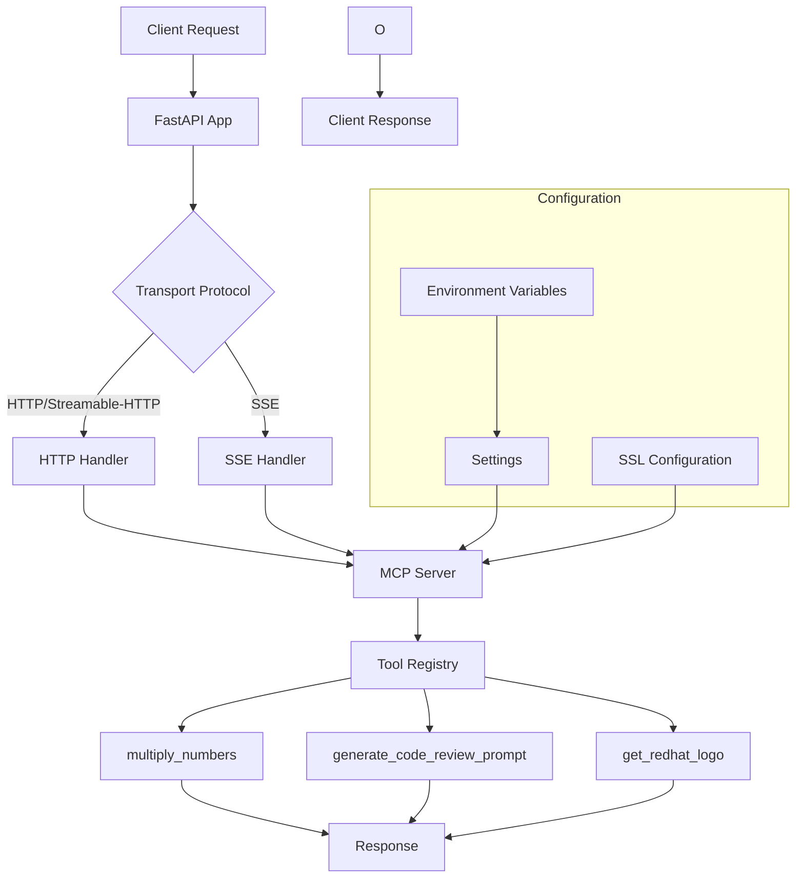

# Template MCP Server

A Model Context Protocol (MCP) server template that provides a foundation for building MCP servers. This template can be customized for various data operations and management functionality.

## 1. Description

The Template MCP Server is a production-ready foundation for building Model Context Protocol (MCP) servers. It provides a complete framework with:

- **FastAPI-based HTTP server** with multiple transport protocol support
- **Modular tool system** for easy extension and customization
- **Comprehensive testing** and deployment configurations
- **OpenShift deployment** ready with SSL support
- **Simplified architecture** with everything organized as tools for maximum agent compatibility

The server supports multiple transport protocols (HTTP, SSE, Streamable-HTTP) and includes built-in tools for mathematical operations, code review prompts, and asset access.

**Design Philosophy**: This template focuses on MCP tools as the primary interface since they have universal support across all MCP clients including LangGraph, CrewAI, and others. This ensures maximum compatibility and ease of use.

## 2. Architecture

### 2.1 Flow Diagram



### 2.2 Code Structure

```
template-mcp-server/
├── template_mcp_server/
│   ├── src/
│   │   ├── main.py              # Server entry point
│   │   ├── api.py               # FastAPI application setup
│   │   ├── mcp.py               # MCP server implementation
│   │   ├── settings.py          # Configuration management
│   │   ├── tools/               # All MCP tools (including converted prompts/resources)
│   │   │   ├── multiply_tool.py
│   │   │   ├── code_review_tool.py
│   │   │   └── redhat_logo_tool.py
│   │   └── assets/              # Static assets used by tools
│   │       └── redhat.png
│   └── utils/
│       └── pylogger.py          # Logging utilities
├── examples/                     # Client examples
│   ├── fastmcp_client.py
│   └── langgraph_client.py
├── tests/                       # Comprehensive test suite
├── openshift/                   # OpenShift deployment configs
├── compose.yaml                 # Container compose configuration
├── Containerfile               # Container definition
└── pyproject.toml             # Project configuration
```

## 3. Quick Start - Create Your Own MCP Server

🚀 **Want to create your own domain-specific MCP server from this template?** Use our automated transformation script!

### 3.1 Automated Template Transformation

The fastest way to create your own MCP server is to use our transformation script. You have two options:

#### Option A: Download Script Only (Recommended)

```bash
# Download the transformation script to your workspace directory
curl -O https://gitlab.cee.redhat.com/dataverse/ai/mcp-servers/template-mcp-server/-/raw/main/scripts/transform-template.sh

# Make it executable
chmod +x transform-template.sh

# Run it (it will clone the template automatically)
./transform-template.sh "your-project-name"

# Example: Create a sales territory MCP server
./transform-template.sh "sales-territory-mcp-server"
```

#### Option B: Clone First, Then Transform

⚠️ **Important**: If you clone first, run the script BEFORE changing into the template directory:

```bash
# Clone this template repository
git clone https://gitlab.cee.redhat.com/dataverse/ai/mcp-servers/template-mcp-server.git

# Run transformation script FROM OUTSIDE the template directory
./template-mcp-server/scripts/transform-template.sh "your-project-name"

# Example: Create a sales territory MCP server
./template-mcp-server/scripts/transform-template.sh "sales-territory-mcp-server"
```

### 3.2 What the Script Does

The transformation script automatically:

- ✅ **Renames all files and directories** with your project name
- ✅ **Updates all code references** from template to your domain
- ✅ **Modifies configuration files** (pyproject.toml, Containerfile, etc.)
- ✅ **Updates documentation** (README, deployment configs)
- ✅ **Preserves all functionality** (tests, tools, deployment configs)
- ✅ **Creates a ready-to-use project** in a new directory

### 3.3 After Transformation

⚠️ **Critical**: You MUST install the package after transformation for imports to work:

```bash
cd your-project-name

# Install the package in development mode (REQUIRED)
pip install -e ".[dev]"

# Now tests will work
pytest  # All tests pass!
```

**Why this step is required**: The transformation script creates a new Python package with your project name (e.g., `party_lens_mcp_server`), but Python needs the package to be installed to import it in tests and runtime.

Then start customizing by:
1. **Adding your domain-specific tools** in `src/tools/`
2. **Updating the example tools** to match your use case
3. **Modifying tests** for your new functionality
4. **Deploying** using the included OpenShift configs

📚 **For detailed transformation documentation**, see [scripts/README.md](scripts/README.md)

## 4. Manual Installation (Alternative)

> 💡 **Tip**: If you just want to use this template to create your own MCP server, use the [transformation script](#3-quick-start---create-your-own-mcp-server) instead of manual installation.

### Prerequisites

- Python 3.12 or higher
- uv (install from https://docs.astral.sh/uv/getting-started/installation/)
- Podman & Podman Desktop (MacOS) -- Need Podman Desktop to install "podman-mac-helper". The "podman-mac-helper" is a utility that facilitates Docker compatibility when using Podman on macOS. It allows users to run Docker commands and tools, like Maven or Testcontainers, without needing to reconfigure them to work with Podman. Essentially, it provides a bridge between the Podman engine and the Docker socket, enabling seamless integration
```bash
# Install podman
brew install podman

# Install Podman Desktop
brew install --cask podman-desktop
```

### Install from source

```bash
# Clone the repository
git clone https://gitlab.cee.redhat.com/dataverse/ai/mcp-servers/template-mcp-server.git
cd template-mcp-server

# Create venv and activate
uv venv --python 3.12
source .venv/bin/activate

# Install the package
uv pip install -e ".[dev]"

# Install RH certificates
wget https://certs.corp.redhat.com/certs/Current-IT-Root-CAs.pem \
    && cat Current-IT-Root-CAs.pem >> `python -m certifi`
```

## 5. Run the pytests

```bash
# Run all tests
make test

# Run tests with coverage
make test-cov

# Run specific test file
pytest tests/test_tools.py

# Run tests with verbose output
pytest -v
```

## 6. Environment File

Copy the contents of `.env.template` to `.env` using the command shown below:

```bash
cp .env.template .env
```

Below is a snapshot of the .env.template file:

```env
# MCP Server Configuration
MCP_HOST=0.0.0.0
MCP_PORT=8080
MCP_TRANSPORT_PROTOCOL=http
# MCP_SSL_KEYFILE=/path/to/ssl_key.pem
# MCP_SSL_CERTFILE=/path/to/ssl_cert.pem

ENABLE_AUTH=False
USE_EXTERNAL_BROWSER_AUTH=False

# Set this to True if you need to plug it into cursor
COMPATIBLE_WITH_CURSOR=True

# Python Logging
PYTHON_LOG_LEVEL=INFO

# This is required only if ENABLE_AUTH is True
SSO_CLIENT_ID=sso_client_id
SSO_CLIENT_SECRET=sso_client_secret
SSO_ISSUER_HOST=https://auth.redhat.com/auth/realms/EmployeeIDP
SSO_CALLBACK_URL=http://localhost:8080/auth/callback/oidc

#  This is required only if ENABLE_AUTH is True
POSTGRES_HOST=localhost
POSTGRES_PORT=5432
POSTGRES_DB=postgres
POSTGRES_USER=postgres
POSTGRES_PASSWORD=postgres
```

## 6. Security Considerations

⚠️ **IMPORTANT**: This server includes an OAuth2 compatibility mode (`COMPATIBLE_WITH_CURSOR`) that significantly reduces security to accommodate certain clients like cursor.


### 6.1 Transport Protocol

The server supports multiple transport protocols that can be configured via the `MCP_TRANSPORT_PROTOCOL` environment variable:

- **http/streamable-http**: Standard HTTP for request-response communication (both use the same implementation)
- **sse**: Server-Sent Events (SSE) for event-driven communication (deprecated)

**Note**: Both **http** and **streamable-http** protocols use the same HTTP implementation and are functionally identical. We recommend using **http** or **streamable-http** for most use cases as they provide the best compatibility and performance. The **SSE protocol** is deprecated and should only be used if specifically required for legacy clients like Goose users on Linux desktop environments.

## 7. Usage (Run locally)

Before running the server locally, make sure a PostgreSQL service is running and accessible. If you don't already have one running, you can start the included PostgreSQL container with:

```bash
podman compose up -d postgres
```

### Method 1: Using Python directly

```bash
# Run the server
python -m template_mcp_server.src.main

#Example: Replace the value in quotes to match your local project
python -m "your_project_name".src.main
```

### Method 2: Using the installed script

```bash
# After installation, you can run the server using the installed script
template-mcp-server
```

### Method 3: Using Podman Container

```bash
# Build the container
make dev
```

## 8. Server Endpoints

Once the server is running, it will be available at:

### 8.1 HTTP Protocol (http/streamable-http)

- **MCP Server**: `http://0.0.0.0:8080/mcp`
- **Health Check**: `http://0.0.0.0:8080/health`

### 8.2 SSE Protocol

- **SSE Endpoint**: `http://0.0.0.0:8080/sse`
- **Health Check**: `http://0.0.0.0:8080/health`

## 9. Deploy on OpenShift

The project includes complete OpenShift deployment configurations in the `openshift/` directory:

```bash
# Create the namespace
oc apply -f openshift/tenant.yaml

# Apply the deployment
oc apply -k openshift/

# Check deployment status
oc get pods -n ddis-asteroid--template

# View logs
oc logs -f deployment/template-mcp-server
```

### Server Endpoints

Once the server is running, it will be available at:

#### HTTP Protocol (http/streamable-http)

- **MCP Server**: `https://template-mcp-server.apps.int.spoke.preprod.us-west-2.aws.paas.redhat.com/mcp`
- **Health Check**: `https://template-mcp-server.apps.int.spoke.preprod.us-west-2.aws.paas.redhat.com/health`

#### SSE Protocol

- **SSE Endpoint**: `https://template-mcp-server.apps.int.spoke.preprod.us-west-2.aws.paas.redhat.com/sse`
- **Health Check**: `https://template-mcp-server.apps.int.spoke.preprod.us-west-2.aws.paas.redhat.com/health`

### OpenShift Configuration

- **Namespace**: `ddis-asteroid--template`
- **Port**: 8443 (HTTPS)
- **SSL**: Configured with TLS certificates
- **Resources**: 1 CPU, 1Gi memory
- **Health Checks**: Liveness and readiness probes configured

## 10. Examples

### Prerequisites
Run the exammples via another shell session in a venv
You can create another venv by doing the following:
```bash
# Create a new venv with a different name from what you are running your server from
uv venv client-examples-venv --python 3.12

# Activate new venv
source client-examples-venv/bin/activate

# Install packages the examples need to run
`uv pip install fastmcp==2.11.3 httpx==0.28.1 langchain-google-genai==2.1.9 langchain-mcp-adapters==0.1.9 langgraph==0.6.6`
```

### FastMCP Client Example

```bash
# Run the FastMCP client example
python examples/fastmcp_client.py
```

This example demonstrates:
- Connecting to the MCP server
- Using available tools (multiply_numbers, generate_code_review_prompt, get_redhat_logo)
- Mathematical operations and code analysis
- Asset retrieval functionality

### LangGraph Client Example

Prerequisites:
- Template MCP server must be running on http://0.0.0.0:8080
- Google Generative AI credentials must be configured via
    GEMINI_API_KEY environment variable or
    GOOGLE_APPLICATION_CREDENTIALS environment variable
- All required Python packages must be installed
- Required dependencies: langchain-google-genai, langchain-mcp-adapters, langgraph

```bash
# Run the LangGraph client example
python examples/langgraph_client.py
```

This example shows:
- LangGraph agent integration
- Google Gemini model usage
- Tool calls for mathematical operations
- Conversational AI workflows

## 10. How to Customize the Template

### Adding New Tools

1. Create a new tool file in `template_mcp_server/src/tools/`:

```python
# template_mcp_server/src/tools/my_tool.py
from typing import Any, Dict
from template_mcp_server.utils.pylogger import get_python_logger

logger = get_python_logger()

def my_custom_tool(param1: str, param2: int) -> Dict[str, Any]:
    """My custom tool description."""
    try:
        # Your tool logic here
        result = f"Processed {param1} with value {param2}"

        logger.info(f"My custom tool executed successfully")

        return {
            "status": "success",
            "operation": "my_custom_tool",
            "result": result,
            "message": "Tool executed successfully"
        }
    except Exception as e:
        logger.error(f"Error in my custom tool: {e}")
        return {
            "status": "error",
            "error": str(e),
            "message": "Tool execution failed"
        }
```

2. Register the tool in `template_mcp_server/src/mcp.py`:

```python
from template_mcp_server.src.tools.my_tool import my_custom_tool

def _register_mcp_tools(self) -> None:
    self.mcp.tool()(multiply_numbers)
    self.mcp.tool()(generate_code_review_prompt)
    self.mcp.tool()(get_redhat_logo)
    self.mcp.tool()(my_custom_tool)  # Add your tool here
```

### Adding Assets

If your tools need to access static files (images, data files, etc.), place them in the `template_mcp_server/src/assets/` directory:

1. Add your asset file to `template_mcp_server/src/assets/`:
   ```
   template_mcp_server/src/assets/
   ├── redhat.png          # Existing logo
   └── my_data_file.json   # Your new asset
   ```

2. Access the asset from your tool:

```python
# template_mcp_server/src/tools/my_data_tool.py
from pathlib import Path
import json

def get_my_data() -> Dict[str, Any]:
    """Read data from assets directory."""
    try:
        current_dir = Path(__file__).parent.parent  # Go up from tools to src
        assets_dir = current_dir / "assets"
        data_path = assets_dir / "my_data_file.json"

        with open(data_path, "r") as f:
            data = json.load(f)

        return {
            "status": "success",
            "data": data,
            "message": "Data retrieved successfully"
        }
    except Exception as e:
        return {
            "status": "error",
            "error": str(e),
            "message": "Failed to read data"
        }
```

### Updating Configuration

1. Add new environment variables to `template_mcp_server/src/settings.py`:

```python
class Settings(BaseSettings):
    # Existing settings...

    MY_CUSTOM_VAR: str = Field(
        default="default_value",
        json_schema_extra={
            "env": "MY_CUSTOM_VAR",
            "description": "Description of your custom variable"
        }
    )
```

2. Update `.env.template` with your new variables:

```env
# Existing variables...
MY_CUSTOM_VAR=your_value
```

### Customizing the Server

1. **Update server behavior**: Modify `template_mcp_server/src/mcp.py`
2. **Add middleware**: Update `template_mcp_server/src/api.py`
3. **Customize logging**: Modify `template_mcp_server/utils/pylogger.py`
4. **Add authentication**: Extend the FastAPI app in `template_mcp_server/src/api.py`

### Testing Your Changes

```bash
# Run tests for your new tools
pytest tests/test_tools.py -k "test_my_tool"

# Run all tests to ensure nothing is broken
pytest

# Run tests with coverage
pytest --cov=template_mcp_server
```

### Container Testing

The project includes comprehensive container tests in `tests/test_container.py` that verify:

- **Rootless container build** with Red Hat UBI Python 3.12
- **Container execution** and health verification
- **SSL/HTTPS configuration** capability
- **Production deployment** readiness

```bash
# Run all container tests (requires podman)
pytest tests/test_container.py -v

# Test specific functionality
pytest tests/test_container.py::TestContainerBuild -v          # Build verification
pytest tests/test_container.py::TestContainerExecution -v     # Runtime testing
pytest tests/test_container.py::TestContainerConfiguration -v # Config validation
pytest tests/test_container.py::TestProductionDeployment -v   # Production readiness
```

**Container Features Tested:**
- ✅ Red Hat UBI base image compliance
- ✅ Rootless operation (no root user required)
- ✅ Virtual environment isolation
- ✅ Red Hat certificate integration
- ✅ HTTP/HTTPS server startup
- ✅ Source code structure validation
- ✅ Podman build and execution validation

**Requirements:**
- `podman` must be available (Red Hat's container engine)
- Network access for base image download
- ~2-3 minutes for initial build

### Design Philosophy and Compatibility

This template follows a **tools-first approach** for maximum compatibility:

- **✅ Everything as Tools**: All functionality (math operations, code review, asset access) is implemented as MCP tools
- **✅ Universal Client Support**: Tools work with all MCP clients including LangGraph, CrewAI, and others
- **✅ Simplified Architecture**: Single `tools/` directory contains all functionality
- **✅ Easy Extension**: Adding new capabilities is as simple as creating a new tool

**Benefits of the Tools-First Approach**:
- **Maximum Compatibility**: Works with any MCP client
- **Consistent Interface**: All functionality accessed through the same tool protocol
- **Easy Testing**: All features can be tested using the same patterns
- **Future-Proof**: As MCP evolves, tools remain the most stable interface

## 11. AI Development Assistant

This template includes `.cursor/rules.md` - a comprehensive development guide specifically designed to help AI coding assistants understand and work effectively with this MCP server template.

### What's Included

The `.cursor/rules.md` file provides:
- **Enterprise containerization patterns** (Podman, Red Hat UBI, rootless containers)
- **MCP development best practices** (tool design, error handling, testing patterns)
- **FastAPI + MCP integration examples** with real code snippets
- **Container testing strategies** matching our `test_container.py` implementation
- **AI assistant guidelines** for working with this specific template architecture

### Usage Options

You have several options for the `.cursor/rules.md` file:

1. **Keep it**: Use as-is to help AI assistants understand your project structure
2. **Customize it**: Modify the file to reflect your specific deployment needs and patterns
3. **Remove it**: Delete the file if you don't need AI development assistance
4. **Contribute improvements**: Submit merge requests with enhancements or fixes

### Contributing

We welcome contributions to improve the AI development assistance:
- **Bug fixes** for incorrect patterns or outdated information
- **New patterns** for common MCP server development scenarios
- **Documentation improvements** for better AI assistant guidance
- **Tool integration examples** for additional development workflows

Submit your improvements via merge request - we value innovations in this area!

### Deployment Considerations

1. **Update container configuration**: Modify `Containerfile` (optimized for Podman/Buildah)
2. **Update OpenShift configs**: Modify files in `openshift/` directory
3. **Update dependencies**: Add new requirements to `pyproject.toml`
4. **Test container changes**: Run `pytest tests/test_container.py -v`
5. **Update documentation**: Modify this README to reflect your changes
